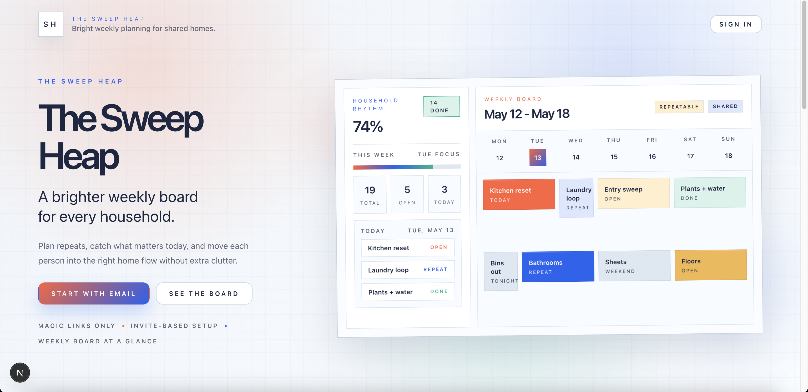
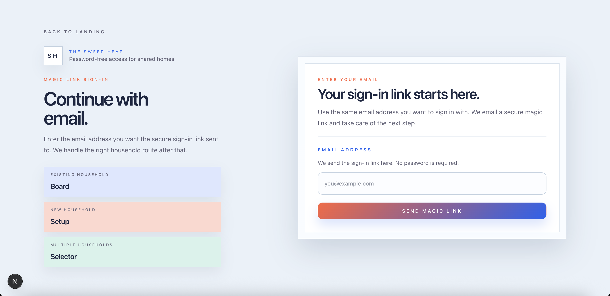
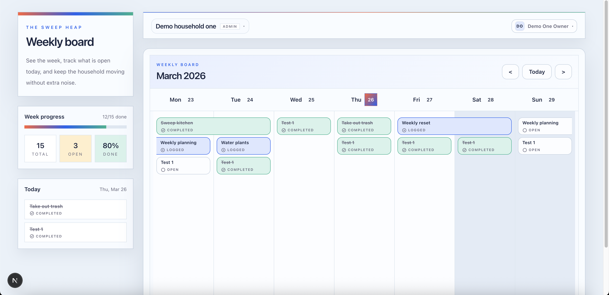
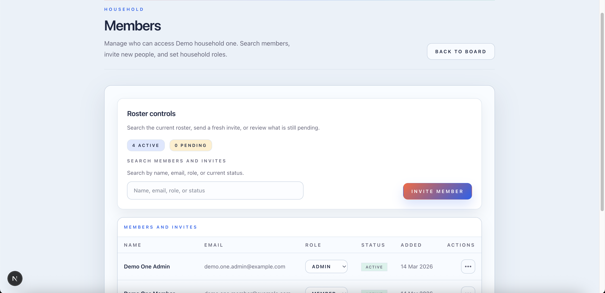
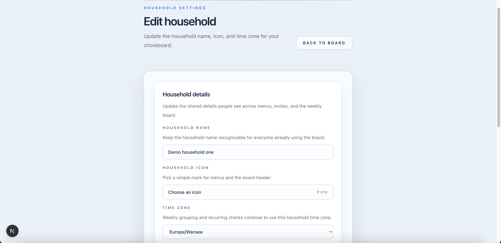
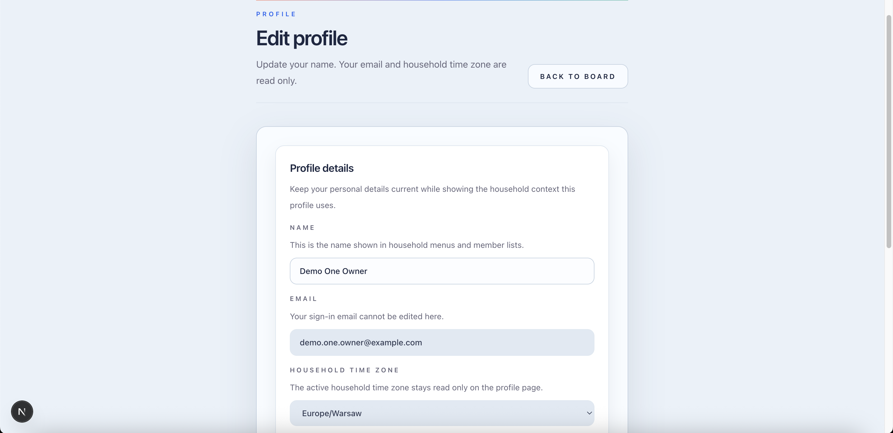

# Product Tour

This walkthrough shows the main product surfaces for The Sweep Heap. The screenshots use seeded demo data and focus on the current MVP flow: landing, sign-in, weekly planning, household management, and personal settings.

## Landing Page

The landing page introduces the app as a shared-home weekly planning board. It pairs the product pitch with a preview of the board layout so visitors can understand the mix of recurring chores, progress tracking, and day-by-day planning before signing in.

## Magic Link Sign-In

Authentication is password-free. The sign-in screen keeps the flow simple with one email field while also explaining the household context a person may land in, whether they are joining an existing home, creating a new one, or choosing between several households.

## Weekly Board

The weekly board is the core product view. It combines a progress summary, a focused Today panel, and a full week grid so chores that are open, logged, or completed stay visible in one place without switching between separate screens.

## Members And Invites

Household membership management is built for ongoing collaboration. The members page shows the current roster, pending invites, role controls, and quick actions for searching people, inviting new members, and keeping household access up to date.

## Household Settings

Household settings keep shared identity details in one place. Owners and admins can update the household name, choose an icon, and set the time zone that drives weekly grouping and recurring chore behavior across the board.

## Profile

Profile settings separate personal details from shared household configuration. The profile page lets each member update their display name while keeping sign-in email and active household time zone visible for context.

